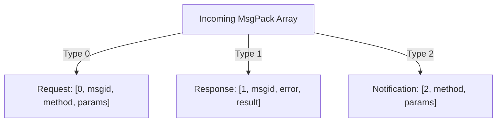
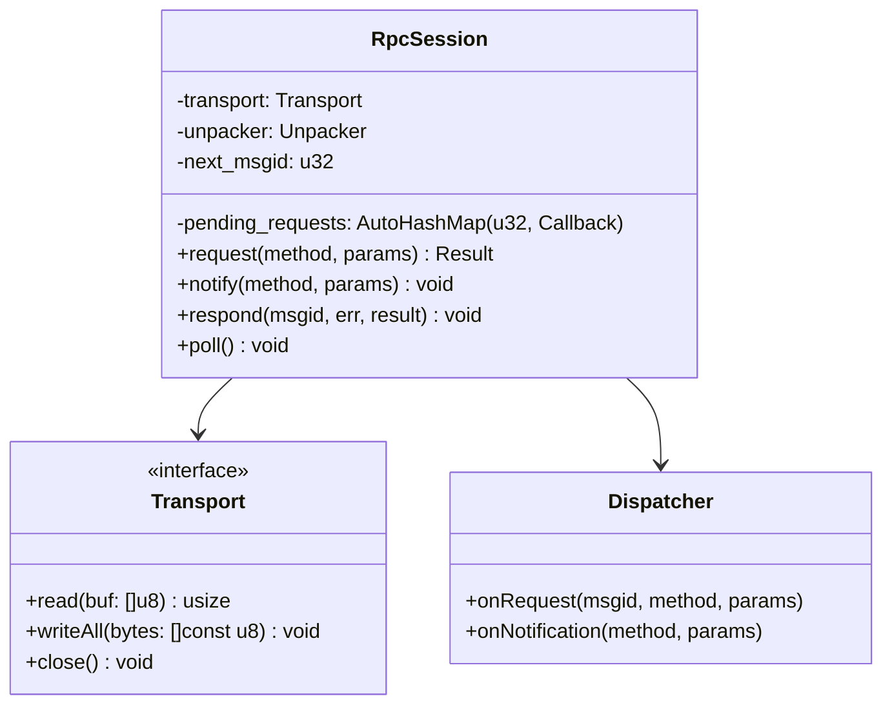
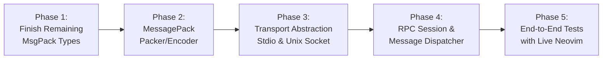

# Neovim MessagePack-RPC Communication Plan

## Goal Description
Neovim exposes an asynchronous, bi-directional API based on **MessagePack-RPC**.
To communicate with Neovim, our Zig application must:
1. Connect over an underlying **transport** (Unix domain socket, stdio, or TCP).
2. Process the **MessagePack-RPC wire protocol** (Requests, Responses, and Notifications).
3. Coordinate request/response synchronization (tracking `msgid` and pending callbacks) and handle inbound notifications/requests from Neovim.

---

## User Review Required

> [!IMPORTANT]
> **Key Architectural Decisions to Align On:**
> 1. **Primary Transport**:
>    - **Stdio (`nvim --embed` or Neovim `jobstart(['plugin'], {'rpc': v:true})`)**: Best for plugins launched by Neovim or standalone CLI tools embedding Neovim.
>    - **Unix Domain Socket (`$NVIM_LISTEN_ADDRESS` or `nvim --listen /tmp/nvim.sock`)**: Best for external tools connecting to an existing running Neovim instance.
> 2. **Concurrency / Threading Model**:
>    - **Reader Thread + Thread-Safe Writer**: A dedicated background thread reads from the socket, feeds `Unpacker`, and dispatches incoming messages. The main thread can call `client.request(...)` or `client.notify(...)`.
>    - **Single-Threaded Polling**: Use non-blocking I/O or run an event loop that checks for data and drives unpacker iterations synchronously.

---

## MessagePack-RPC Protocol Overview

Every RPC message on the wire is a 3-element or 4-element MessagePack array:



### 1. Request (`type = 0`)
```text
[0, msgid, "method_name", [args...]]
```
- Expects a corresponding **Response** with matching `msgid`.
- Can be initiated by our client (e.g. calling `nvim_eval("2 + 2")`) or by Neovim (if Neovim calls a method registered by the client).

### 2. Response (`type = 1`)
```text
[1, msgid, error, result]
```
- Sent in reply to a Request with the matching `msgid`.
- If successful: `error = nil`, `result = <data>`.
- If failed: `error = <string/object>`, `result = nil`.

### 3. Notification (`type = 2`)
```text
[2, "method_name", [args...]]
```
- One-way fire-and-forget message (no `msgid`, no response expected).
- Common examples: UI events, buffer changes (`nvim_buf_lines_event`), custom plugin notifications.

---

## Proposed Component Architecture



### 1. `Transport` Layer (`src/transport.zig`)
Encapsulates raw byte read/write capabilities across platforms:
- `UnixSocketTransport`: Connects to Neovim socket (`std.net.connectUnixSocket`).
- `StdioTransport`: Uses stdin (`std.io.getStdIn()`) and stdout (`std.io.getStdOut()`).

### 2. `RpcSession` Layer (`src/rpc.zig`)
Maintains the bi-directional state machine:
- **Sending requests**: Increments `next_msgid`, registers a pending response callback/condition, encodes `[0, msgid, method, params]` using `Packer`, and writes to transport.
- **Reading messages**: Reads chunks into a buffer, calls `unpacker.feed(chunk)`, and loops while `unpacker.next()` yields objects:
  - If `type == 1` (Response): Matches `msgid` in the pending requests map, triggers the caller's continuation, and removes from map.
  - If `type == 0` (Request): Invokes handler callback and sends back `[1, msgid, err, result]`.
  - If `type == 2` (Notification): Dispatches to registered notification handler.

---

## Step-by-Step Implementation Roadmap



### Phase 1: Complete MessagePack Types in `Unpacker`
Before building RPC, `Unpacker` needs the remaining types used by Neovim:
- Negative fixint (`0xe0...0xff`)
- Fixed & sized integers (`int8/16/32/64`, `uint8/16/32/64`)
- Boolean (`true`, `false`) and `nil`
- Strings (`str8`, `str16`, `str32`)
- Binary (`bin8/16/32`)
- Maps (`fixmap`, `map16`, `map32`)
- Extension types (`fixext1/2/4/8/16`, `ext8/16/32` for Neovim handles like Buffer/Window)

### Phase 2: MessagePack Encoder (`Packer`)
Implement serialization to write outgoing RPC messages:
- Writes bytes to an `Io.Writer` or dynamic byte list.
- Functions to pack: integers, booleans, nil, strings, arrays, maps, and ext types.
- Helper functions: `packRequest()`, `packResponse()`, `packNotification()`.

### Phase 3: Transport Layer
Create simple, idiomatic wrappers for reading and writing byte streams:
- Unix domain socket connector (macOS / Linux).
- Standard I/O connector (for embedding in child process / job).

### Phase 4: RPC Session & Dispatcher
Implement the session engine:
- `msgid` generation & pending callback tracking.
- Read loop that feeds incoming bytes to `Unpacker` and dispatches messages.
- Clean error handling (disconnects, timeouts, malformed messages).

### Phase 5: Live Verification
- Launch a test Neovim instance: `nvim --headless --listen /tmp/test-nvim.sock`.
- Connect our Zig client to the socket.
- Execute `nvim_eval("1 + 1")` and assert result is `2`.
- Send an async notification and verify receipt.

---

## Verification Plan

### Automated Unit Tests
1. **RPC Message Encoding/Decoding**:
   - Roundtrip tests for `[0, 1, "nvim_eval", ["2 + 2"]]`.
   - Response validation `[1, 1, null, 4]`.
   - Notification dispatch `[2, "redraw", []]`.
2. **Pending Request Table**:
   - Out-of-order responses matching their respective `msgid`.

### Integration Tests
- A Zig test that spawns a headless Neovim process (`nvim --embed` or `--listen`), sends RPC requests, and verifies the decoded response.
